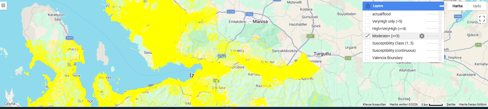

# floodriskmap
A flood susceptibility map was generated using a weighted multi-criteria approach integrating SRTM-derived terrain parameters, MERIT Hydro variables, distance to water, and ESA WorldCover land cover data. The resulting continuous index was classified into five percentile-based risk classes, excluding permanent water areas.

This script generates a flood susceptibility (risk) map using a multi-criteria weighted linear combination (WLC) approach in Google Earth Engine. It produces both a continuous susceptibility index and a 5-class susceptibility map, while excluding permanent water areas.

Inputs

AOI (study boundary): FeatureCollection asset (gns)

DEM: SRTM (USGS/SRTMGL1_003)

Hydrology: MERIT Hydro (MERIT/Hydro/v1_0_1)

upa (upslope contributing area)

hnd (HAND: height above nearest drainage)

Land Cover: ESA WorldCover v100 (ESA/WorldCover/v100)

Optional reference flood map: local asset (valenciaflood) for visual comparison

Workflow Summary

Set AOI and clip all datasets to the study area.

Mask permanent water using ESA WorldCover class 80.

Derive or prepare risk factor layers (scaled 1–5):

Land cover risk (remapped from WorldCover classes)

Elevation risk (from SRTM)

Slope risk (from SRTM)

TWI risk (using MERIT upa and slope-based approximation)

Distance-to-water risk (distance transform from permanent water)

HAND risk (MERIT hnd)

Drainage risk (MERIT upa)

Curvature risk (DEM-based smoothing difference)

Compute continuous susceptibility using a weighted WLC formula:

2.0*LC + 3.5*Elevation + 3.5*Slope + 4.5*TWI + 2.5*DistWater + 5.0*HAND + 3.5*Drainage + 2.0*Curvature

Classify susceptibility into 5 levels using percentile thresholds (p10, p25, p45, p65).

Create optional binary masks:

Moderate+ (≥3)

High+Very High (≥4)

Very High (5)

Outputs

Map layers

Continuous susceptibility (continuous index)

Susceptibility class map (1–5)

Optional masks (Moderate+, High+, Very High)

Optional actual flood layer (for comparison)

Exports (Google Drive)

Continuous susceptibility raster

Classified susceptibility raster (1–5)

Moderate-or-higher mask raster

Notes

The susceptibility classes are relative to the AOI, since thresholds are derived from AOI percentiles.

Permanent water is removed to avoid inflating risk in lakes/sea surfaces.

The included valenciaflood layer is not used in modeling—it is only for visual validation/interpretation.

How to Run

Paste the script into the Google Earth Engine Code Editor.

Ensure your AOI and optional flood assets are accessible.

Run the script and inspect layers in the map.

Start exports from the Tasks tab.

